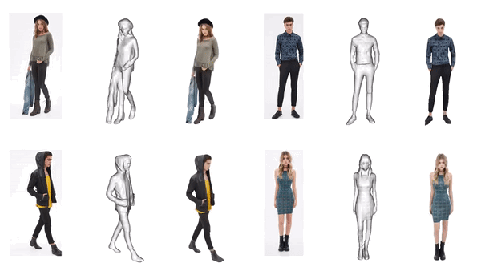

## Potential of 2D Priors for Improving Robustness of Ill-Posed 3D Reconstruction

This repository contains code for the experiments of our project for EPFL CS 503 Visual Intelligence. 

In this project we focus on the problem of comprehensive
human full-body mesh reconstruction from a single image,
which is assumed to be taken in daily settings. We tackle the problem of lack of information and corruption by integrating different 2D priors into the workflow to
enhance the robustness of 3D generative models. In other words, we enhance 3D generative performance by leveraging pretrained 2D priors, and investigate different integration techniques for best performance. 

<p align="center" width="100%">
    
</p>

## Contents
- [Usage](#usage)
- [Code](#code)
- [Build the environment](#build-the-environment)


### Usage 

To train and Evaluate the models using the code, use the following prompts: 

```
############## TTA on Vanilla PIFu ##############

# Train for 5 epochs 

python -m apps.train_tta --dataroot <path/to/the/dataset>  --checkpoints_path ./tta_baseline_5_sample --load_netG_checkpoint_path <path/to/PIFu/net_G> vanilla-baseline/netG_epoch_10  --batch_size 16 --tta_adapt_sample 5 --num_epoch 5

############## Train the model with DPT and CLIP ##############

# With a MLP (multi-player perception) with size `258 -> 1024 -> 512 -> 256 -> 128 -> 1`. 

# Train from fresh for 5 epochs 
python -m apps.train_shape --dataroot <path/to/the/dataset>  --checkpoints_path ./primser --batch_size 16 --mlp_dim 258 1024 512 256 128 1 --use_dpt True --freeze_encoder True --feature_fusion prismer --load_netG_checkpoint_path <path/to/PIFu/net_G> --num_epoch 5 --name prismer --use_clip_encoder True

# Continue training 
CUDA_VISIBLE_DEVICES=0 python -m apps.train_shape --dataroot <path/to/the/dataset>  --checkpoints_path ./primser --batch_size 16 --mlp_dim 258 1024 512 256 128 1 --use_dpt True --freeze_encoder True --feature_fusion prismer --load_netG_checkpoint_path <path/to/PIFu/net_G> --num_epoch 5 --name prismer --use_clip_encoder True --continue_train --checkpoints_path <path/to/PIFu/primser> --resume_epoch 3

############## Train the model with only CLIP ##############

# Train for 5 epochs from fresh 
python -m apps.train_shape --dataroot <path/to/the/dataset>  --checkpoints_path ./primser --batch_size 16 --mlp_dim 258 1024 512 256 128 1  --freeze_encoder True --feature_fusion prismer --load_netG_checkpoint_path <path/to/PIFu/net_G> --num_epoch 5 --name prismer --use_clip_encoder True

############## Train the baseline geometric network ##############

# Train for 10 epochs from fresh 

python -m apps.train_shape --dataroot <path/to/the/dataset>  --checkpoints_path ./baseline_G --batch_size 16  --gpu_ids "0,1" --num_epoch 10

# Continune training 

CUDA_VISIBLE_DEVICES=0 python -m apps.train_shape --dataroot <path/to/the/dataset>  --checkpoints_path ./baseline_G --batch_size 16   --num_epoch 30 --pin_memory --continue_train --resume_epoch 9 --checkpoints_path ./baseline_G --name vanilla-baseline

############## Train the baseline geometric network with CLIP ##############

# Train for 5 epochs from fresh 
python -m apps.train_shape --dataroot <path/to/the/dataset>  --checkpoints_path ./baseline_clip_G --batch_size 16  --num_epoch 5 --name clip_baseline --feature_fusion add --learning_rate 0.001 --use_clip_encoder True

# Continue training 

python -m apps.train_shape --dataroot <path/to/the/dataset>  --checkpoints_path ./baseline_clip_G --batch_size 16  --num_epoch 5 --name clip_baseline --feature_fusion add --learning_rate 0.001 --continue_train --resume_epoch 4
```

### Code 
This codebase provides code for: 

**Models, data and rendering**
Our backbone is PIFu model. We included the vanilla PIFu model, PIFu variants, PIFu with CLIP loss, and other helper functions in the folder `lib/model`. The train and evaluation dataset fed into the network are processed by the code in `lib/data`. 

During the training, we need to render images of the specified angles from the human mesh models, and the code for rendering are in the folder `lib/renderer`. 

Other files under the `lib` directory are also helper functions for the training. 

**Data augmentation via corruption**

We augment the dataset by corrupting part of the rendered images, and the code for creating the dataset is in the folder `data/3d_common_corruptions/create_3dcc/motions_video`. 

**Training and evaluating**
The code for training and evaluating, and also the camera settings are in the folder `apps`. 

### Build the environment 
```
############## For original PIFu ##############
conda create -n orig_pifu python=3.8
conda activate orig_pifu 

conda install pytorch==1.13.0 torchvision==0.14.0 pytorch-cuda=11.6 -c pytorch -c nvidia
conda install pillow
conda install scikit-image
conda install tqdm

pip install numpy cython
pip install menpo
pip install opencv-python

# in case of error with numpy
pip uninstall numpy
pip install numpy==1.22.4

# in case of error "cannot marching cubes"
# Open PIFu/lib/mesh_util.py and change line 45 to:
# verts, faces, normals, values = measure.marching_cubes(sdf, 0.5)

############## For PIFuHD ##############
pip install pyembree
# conda install -c conda-forge pyembree
pip install PyOpenGL
# freeglut (use sudo apt-get install freeglut3-dev for ubuntu users)
# this one we can't do it
pip install ffmpeg

pip install rembg[gpu]

pip uninstall numpy
pip install numpy==1.22.4
```