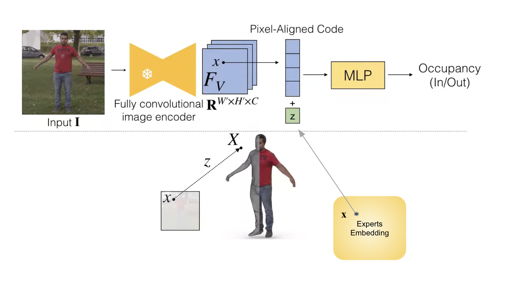

## Potential of 2D Priors for Improving Robustness of Ill-Posed 3D Reconstruction

This repository contains code for the experiments of our project for EPFL CS 503 Visual Intelligence. 

In this project we focus on the problem of comprehensive
human full-body mesh reconstruction from a single image,
which is assumed to be taken in daily settings. We tackle the problem of lack of information and corruption by integrating different 2D priors into the workflow to
enhance the robustness of 3D generative models. In other words, we enhance 3D generative performance by leveraging pretrained 2D priors, and investigate different integration techniques for best performance. 

<p align="center" width="100%">
    
</p>

## Contents
- [Potential of 2D Priors for Improving Robustness of Ill-Posed 3D Reconstruction](#potential-of-2d-priors-for-improving-robustness-of-ill-posed-3d-reconstruction)
- [Contents](#contents)
  - [0. Work done](#0-work-done)
  - [1. Environment Configuration](#1-environment-configuration)
  - [Training and testing](#training-and-testing)
  - [Code](#code)
  - [Data Augmentation](#data-augmentation)
- [Acknowledgements](#acknowledgements)

### 0. Work done 

* Environment Configuration 
- [x] For rendering `THuman2.0` data with [JIFF](https://github.com/yukangcao/JIFF) code 
- [x] For training [PIFu](https://github.com/shunsukesaito/PIFu)
- [x] For data augmentation through commom corruptions 
* Data Preprocessing 
- [x] `THuman2.0` data rendering 
- [x] Data augmentation through commom corruptions 
* Model Training and testing 
- [x] Testing PIFu on augmented data 
- [x] Test-time adaptation of PIFu on the augmented data 
- [x] Post-training refinement with CLIP semantic loss 
- [x] Multimodal post-training refinework with CLIP semantic loss and DPT depth loss 

### 1. Environment Configuration 

The environment for `original PIFu` training and testing, 
```
conda create -n orig_pifu python=3.8
conda activate orig_pifu 

conda install pytorch==1.13.0 torchvision==0.14.0 pytorch-cuda=11.6 -c pytorch -c nvidia
conda install pillow
conda install scikit-image
conda install tqdm

pip install numpy cython
pip install menpo
pip install opencv-python

# in case of error with numpy
pip uninstall numpy
pip install numpy==1.22.4

# in case of error "cannot marching cubes"
# Open PIFu/lib/mesh_util.py and change line 45 to:
# verts, faces, normals, values = measure.marching_cubes(sdf, 0.5)
```

The environment for `PIFuHD` training and testing, 

```
pip install pyembree
# conda install -c conda-forge pyembree
pip install PyOpenGL
# freeglut (use sudo apt-get install freeglut3-dev for ubuntu users)
# this one we can't do it
pip install ffmpeg

pip install rembg[gpu]

pip uninstall numpy
pip install numpy==1.22.4
```

### Training and testing 

1. Test time adaptation on Vanilla PIFu

Test time adaptation on vanilla PIFu using the corrupted data to enhance the model's robustness. 

Finetuning for 5 epochs: 
```
python -m apps.train_tta --dataroot <path/to/the/dataset>  --checkpoints_path ./tta_baseline_5_sample --load_netG_checkpoint_path <path/to/PIFu/net_G> vanilla-baseline/netG_epoch_10  --batch_size 16 --tta_adapt_sample 5 --num_epoch 5
```

2. Training the model with only CLIP 

Training the model with self-supervised refinement of the texture network using CLIP (semantic prior) loss. 

Training for 5 epochs from fresh: 
```
python -m apps.train_shape --dataroot <path/to/the/dataset>  --checkpoints_path ./primser --batch_size 16 --mlp_dim 258 1024 512 256 128 1  --freeze_encoder True --feature_fusion prismer --load_netG_checkpoint_path <path/to/PIFu/net_G> --num_epoch 5 --name prismer --use_clip_encoder True
```

3. Training the baseline geometric network

Training the baseline geometric network using the augmented data. 

Training for 10 epochs from fresh: 
```
python -m apps.train_shape --dataroot <path/to/the/dataset>  --checkpoints_path ./baseline_G --batch_size 16  --gpu_ids "0,1" --num_epoch 10
```

Continuing training for 30 epochs: 
```
CUDA_VISIBLE_DEVICES=0 python -m apps.train_shape --dataroot <path/to/the/dataset>  --checkpoints_path ./baseline_G --batch_size 16   --num_epoch 30 --pin_memory --continue_train --resume_epoch 9 --checkpoints_path ./baseline_G --name vanilla-baseline
```

4. Training the baseline geometric network with CLIP 

Training the baseline geometric network with self-supervised refinement of the texture network using CLIP loss. 

Training for 5 epochs from fresh: 
```
python -m apps.train_shape --dataroot <path/to/the/dataset>  --checkpoints_path ./baseline_clip_G --batch_size 16  --num_epoch 5 --name clip_baseline --feature_fusion add --learning_rate 0.001 --use_clip_encoder True
```

Continuing training for 5 epochs: 
```
python -m apps.train_shape --dataroot <path/to/the/dataset>  --checkpoints_path ./baseline_clip_G --batch_size 16  --num_epoch 5 --name clip_baseline --feature_fusion add --learning_rate 0.001 --continue_train --resume_epoch 4
```

5. Train the model with DPT and CLIP

Training the model with multimodel learning with DPT (depth prior) and CLIP prior. 

Training from fresh for 5 epochs: 

```
python -m apps.train_shape --dataroot <path/to/the/dataset>  --checkpoints_path ./primser --batch_size 16 --mlp_dim 258 1024 512 256 128 1 --use_dpt True --freeze_encoder True --feature_fusion prismer --load_netG_checkpoint_path <path/to/PIFu/net_G> --num_epoch 5 --name prismer --use_clip_encoder True
```

Continuing training: 
```
CUDA_VISIBLE_DEVICES=0 python -m apps.train_shape --dataroot <path/to/the/dataset>  --checkpoints_path ./primser --batch_size 16 --mlp_dim 258 1024 512 256 128 1 --use_dpt True --freeze_encoder True --feature_fusion prismer --load_netG_checkpoint_path <path/to/PIFu/net_G> --num_epoch 5 --name prismer --use_clip_encoder True --continue_train --checkpoints_path <path/to/PIFu/primser> --resume_epoch 3
```

### Code 
This codebase provides code for: 

**Models, data and rendering**
Our backbone is PIFu model. We included the vanilla PIFu model, PIFu variants, PIFu with CLIP loss, and other helper functions in the folder `lib/model`. The train and evaluation dataset fed into the network are processed by the code in `lib/data`. 

During the training, we need to render images of the specified angles from the human mesh models, and the code for rendering are in the folder `lib/renderer`. 

Other files under the `lib` directory are also helper functions for the training. 

**Data augmentation via corruption**

We augment the dataset by corrupting part of the rendered images, and the code for creating the dataset is in the folder `data/3d_common_corruptions/create_3dcc/motions_video`. 

**Training and evaluating**
The code for training and evaluating, and also the camera settings are in the folder `apps`. 

### Data Augmentation 

In this project, we augment the dataset with corrupted images. We borrowed part of the code from the paper: [**3D Common Corruptions and Data Augmentation**](https://3dcommoncorruptions.epfl.ch/). 

We utilize 4 different kinds of corruptions, including low_light, iso_noise, camera_roll, and zoom_blur. Specifically, for each model, we have 360 rendered images from 360 different angles. For each model's rendered images, we pick `1/5` of data for each kind of corruption and leave the rest `1/5` as they are. 

To corrupted the images, use the command line
```
python -m data.3d_common_corruptions.create_3dcc.corrupt.py --RENDER_PATH <path/to/the/rendered/images> --MASK_PATH <path/to/the/masks>
```

## Acknowledgements 

Our implementation is based on [PIFu](https://github.com/shunsukesaito/PIFu), [JIFF](https://github.com/yukangcao/JIFF), [3D Common Corruptions](https://3dcommoncorruptions.epfl.ch/), [CLIP](https://github.com/openai/CLIP), and [Prismer](https://shikun.io/projects/prismer). 